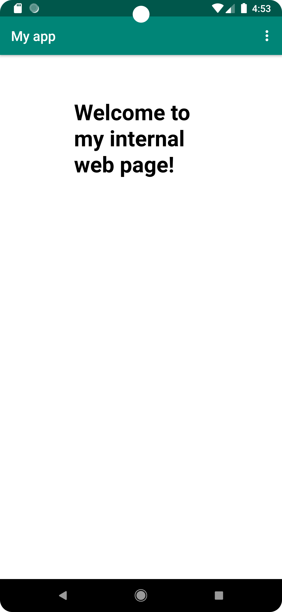
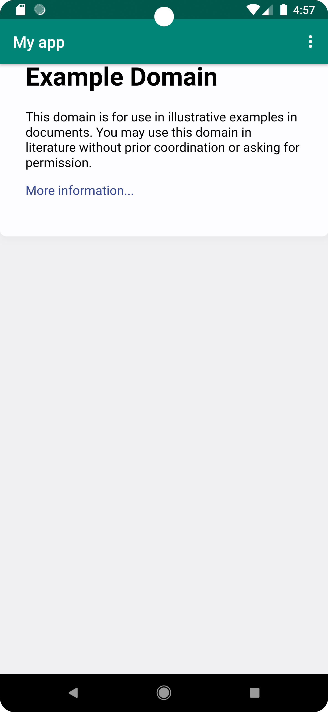

# Rapport

Ändrade namnet på appen genom att ändra stringen från Hello World! till My app i res/values/strings.xml

Aktiverade internetåtkomst genom att implementera följande kod: 

```
xmlns:android="http://schemas.android.com/apk/res/android"
package="com.example.webviewapp">
<uses-permission android:name="android.permission.INTERNET" />
```

Skapade en WebView element i layout filen 'activity_main.xml' och gav WebView ett ID som ses i följande kod:

```
    <WebView
        android:id="@+id/my_webview"
        android:layout_width="match_parent"
        android:layout_height="match_parent"/>
```

Skapade en privat variabel av typen 'WebView' i MainActivity.java och instansierade den i 'onCreate()' 
med hjälp av findViewById(). 

Lokaliserade WebView elemented genom att implementera 'R.id.my_webview' i findViewById metoden.

Skapade en ny WebViewClient i 'onCreate()' med hjälp av följande kod:

```
        myWebView.setWebViewClient(new WebViewClient());
```
Detta tillåter oss att surfa på webben i vår app.

För att tillåta körning av Javascript i min WebViewClient implementerades två metoder i 'onCreate()' 
metoden, getSettings() och setJavaScriptEnabled() som ses i följande kod: 

```
        WebSettings webSettings = myWebView.getSettings();
        webSettings.setJavaScriptEnabled(true);
```

En html sida lades till som en tillgång för att sedan länkas till i showInternalWebPage() metoden. 
Denna html sida är en enkel sida som endast visar följande text: Welcome to my internal web page!

Två metoder implementerades, showInternalWebPage() och showExternalWebPage(). I dessa metoder används
'loadUrl()'. 
För att visa en external web page implementeras 'url' i 'loadUrl()'. 
För att visa en internal web page implementeras 'baseUrl + htmlFilename' i 'loadUrl()', där baseUrl 
är en string till "file:///android_asset/" och htmlFilename är en string till "internalPage.html"

Bild på internal web page


Bild på external web page


